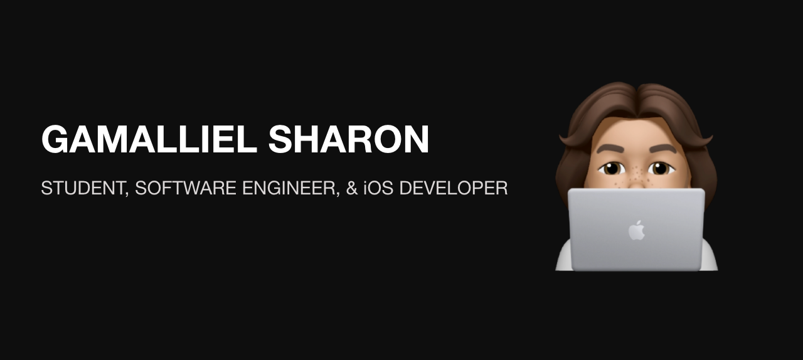

### Hi, I'm Gamal 👋

<!--
**Gamalliel19/Gamalliel19** is a ✨ _special_ ✨ repository because its `README.md` (this file) appears on your GitHub profile.

I'm a student from Institute Technology of PLN who is passionate about making web and mobile applications, creating technology to elevate people, and building community. Some technologies I enjoy working with include ReactJS, Flutter(Learn), Swift(Learn), and MySQL. I also like to designing some applications and implement it to a real apps.

## Find Me On Social Media!

<a href="https://www.instagram.com/gmllshrn/" > Instagram </a>

Here are some ideas to get you started:

- 🔭 I’m currently working on ...
- 🌱 I’m currently learning ...
- 👯 I’m looking to collaborate on ...
- 🤔 I’m looking for help with ...
- 💬 Ask me about ...
- 📫 How to reach me: ...
- 😄 Pronouns: ...
- ⚡ Fun fact: ...
-->
